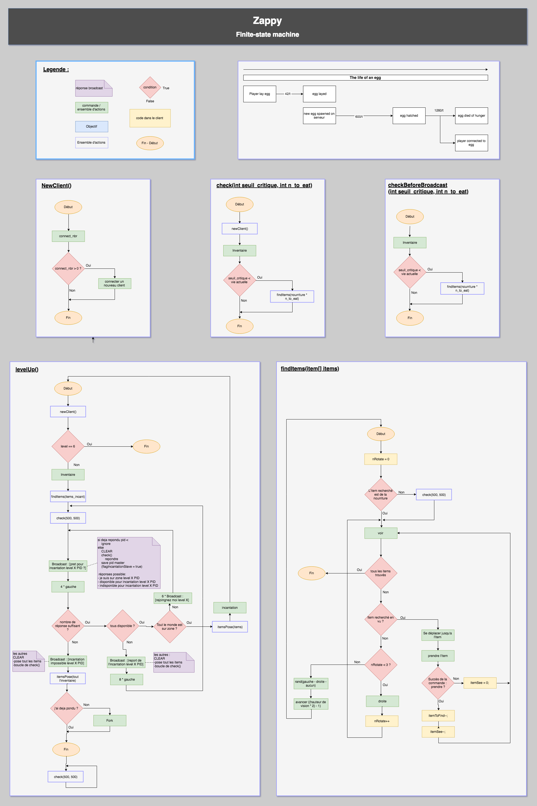
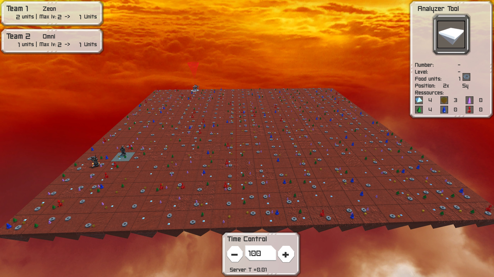
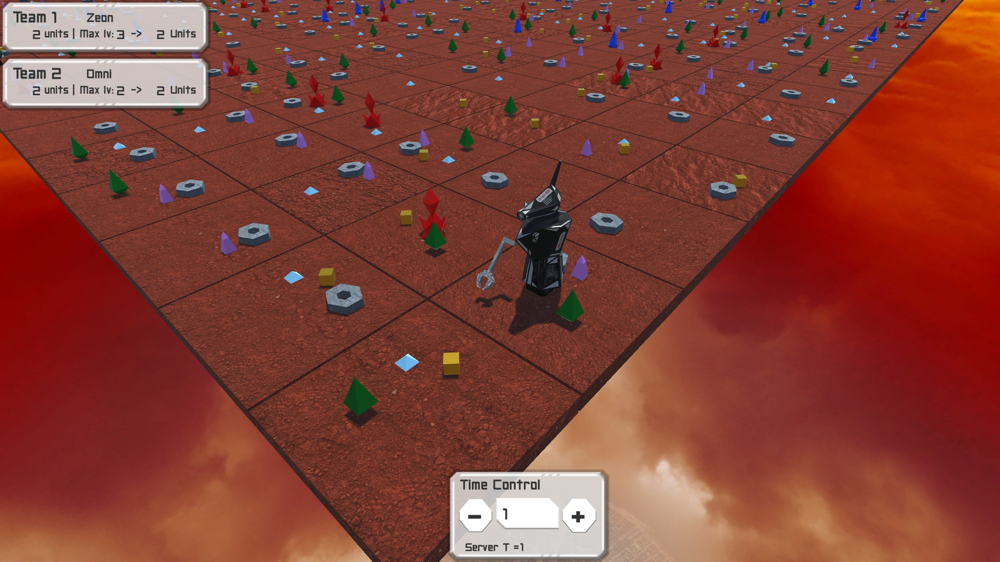
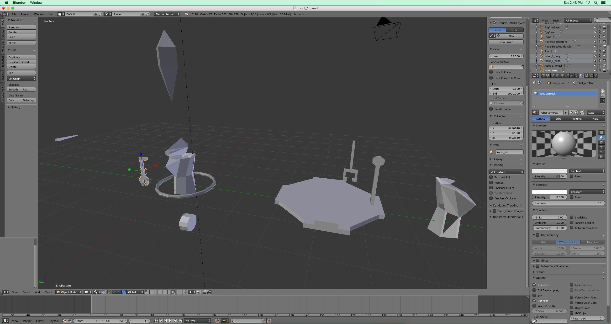

| Language | Field                            | Project | Grade |
| :------: |:--------------------------------:| :------:|:-----:|
| C/C++, C# | Algorithms & AI - Network - UNIX | Trio   |119/125|
---
# Zappy
Zappy is a multiplayer online game in which players are autonomous and controlled by individual AI.  
The first team to get 6 players at max level wins.  
To level-up, players must collect the right resources (stone) on the map and join his teammates to start a _level-up ritual_ together.  
To stay alive, players must collect food on the map.  
Players can lay an egg to increase the number of players in the team.

## Project
The challenge of this project is the decision-making and synchronization of all players-AI.
This project is composed of 3 distinct programs:

- __Server__: Implemented as a TCP/IP server, it manages the map and every single action of the game.

- __Graphical client__: 3D interface implemented in C# with Unity. Connects to the server and displays what is happening on the server.

- __Client-AI__: Connects to the server and drives a player.

## AI
__Artificial Intelligence__ uses a decision-making algorithm is based on a [Finite state machine](https://en.wikipedia.org/wiki/Finite-state_machine) principle as following:  

## Screenshot

Model meshes:

Server-clients output examples:

By [scaussin](https://github.com/scaussin), [aleung-c](https://github.com/aleung-c) and [alegay](https://github.com/alegay)
